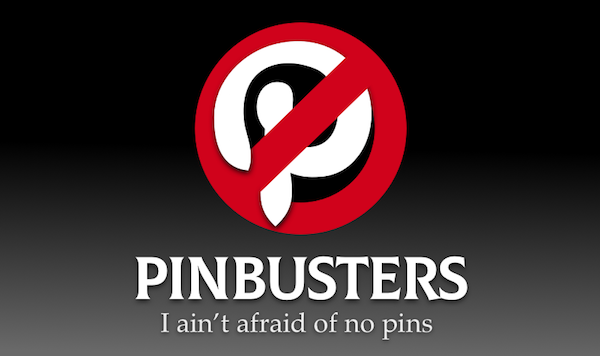

# PINBUSTERS
- Are you troubled by strange images in the middle of your Google Image Search?
- Do you experience feelings of dread when you realize these images are actually coming from Pinterest?
- Have you or your family ever seen a Pin, Pinboard or "Tried any of these"?

If the answer is **YES**, then don't wait another minute. Open your browser and reach out to the professionals: **PINBUSTERS!**

Our courteous and efficient [Google Chrome](https://chrome.google.com/webstore/detail/pinbusters/kakcofganmlibjmagofeimjhailodnod) extension is on call 24 hours a day to serve all your Pin elimination needs.

We're ready to bust your pins!

## Install in your browser
- Google Chrome: [Extension](https://chrome.google.com/webstore/detail/pinbusters/kakcofganmlibjmagofeimjhailodnod)
- Other browsers: 
    - [Tampermonkey script](https://greasyfork.org/en/scripts/39154-pinbusters)
    - [OpenUserJS script](https://openuserjs.org/scripts/bzx/Pinbusters)
    - requires [Tampermonkey plugin](http://tampermonkey.net) which is compatible with Safari, Chrome, Firefox, Opera Next, Microsoft Edge, Dolphin and UC Browser.

## But.. what does it do?

This extension hides all Pinterest images that appear in your Google Image Search. Well, technically it creates an overlay with Pinbusters logo on top of them, so that you know where *not to* click. 

However, you can still click that image, and you will see the expanded image panel in its original form, with the "pinned" image displayed and original functionality available.

## But.. why?

#### tldr;

It's a time saver.

#### I still don't get it

All images that you can find on Pinterest come from other websites, so in order to reach that original website, you need to go through Pinterest. This is not always straightforward as the "pinned" image you're after may not appear as the first image on the Pinterest page, so you will still have to look for it. As soon as you scroll down a bit, Pinterest will require you to login.. and by that time you probably wish you didn't click that image in the first place (you may have an active Pinterest account.. but you get the point).

Furthermore, some images "pinned" to Pinterest are automatically scaled down, which may affect original image quality.

### Credits & Inspiration
- [Joshua B](https://github.com/bijij/) – I used code from his [View Image](https://github.com/bijij/ViewImage/) extension, which I also use and can recommend.
- Dr. Ray Stantz
- Dr. Egon Spengler
- Dr. Peter Venkman
- Dr. Winston Zeddemore
